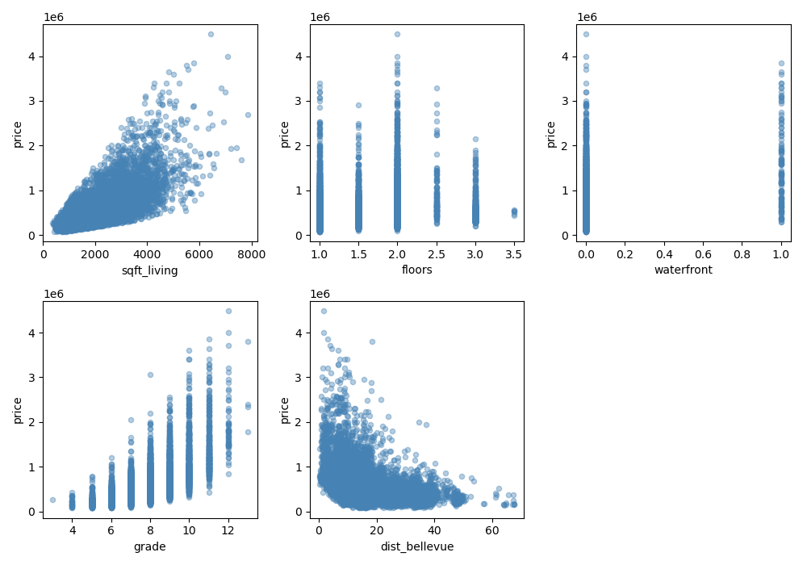
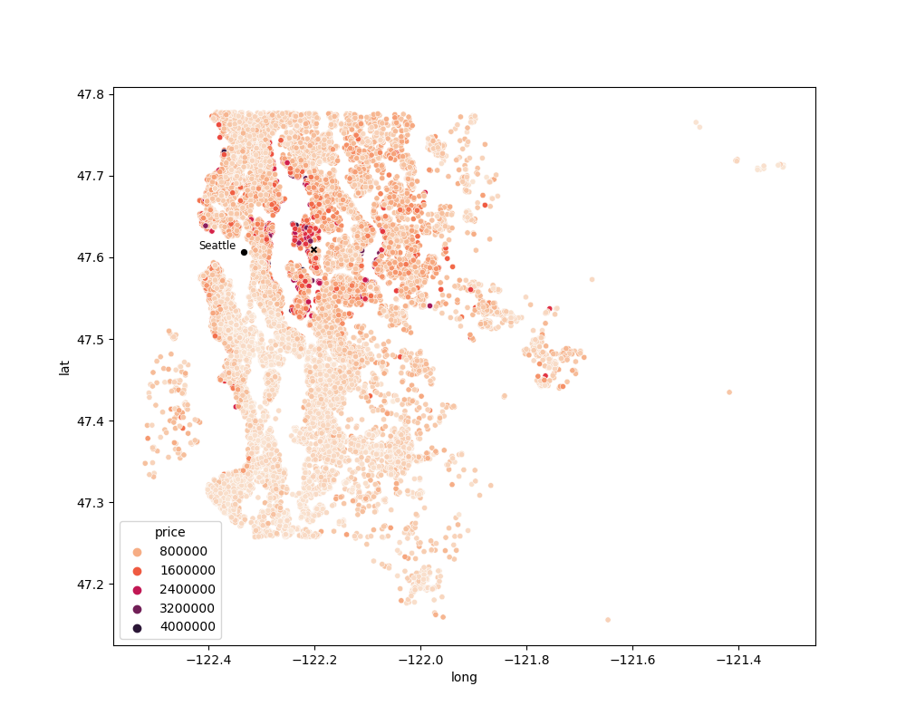

# King County House Sales Regression Analysis
***
**Author:** Rebecca Chu


## Overview

This project undertakes a multiple linear regression analysis to explore which features of a house in King County were the best predictors of its sale price between May 2014 to May 2015. The goal was to identify the strongest variables associated with price for King County Real Estate Agency, to improve their accuracy in determining a recommended listing price that would be profitable for the seller while still attractive to buyers. Using an iterative approach to model-building, our final model found that the total living area, building grade of the house, number of floors, waterfront views, and distance to Bellevue had significant associations with price. It is recommended that a homeowner increases the size of their living space and their building grade via renovations, should they be looking to increase the value of their house. 


## Business Problem

King County Real Estate Agency is looking to improve their accuracy when determining a recommended listing price for their clients' properties so that sellers are able to sell their houses within a reasonable timeframe but still at a maximum profit. 

This analysis explored the following questions:
* Which features of a house are the best predictors for price?
* What actionable insights can be recommended to a homeowner to increase the price of their property?


## Data

King County House Sales data was provided for this project. The dataset provided property information for 21,597 houses that were sold between May 2014 and May 2015. The target variable is house sale prices.

A brief description of column names can be found in `column_names.md` in the `data` folder. For more detail, please refer to the King County website's Residential Glossary of Terms (https://info.kingcounty.gov/assessor/esales/Glossary.aspx?type=r). 


## Methods

This project utilises an iterative approach to building a multiple linear regression model. I began by cleaning the dataframe (converting datatypes as necessary, dropping columns irrelevant to my analysis, and dealing with nulls). The following metrics were also created: 
* Month the house was sold
* The age of the building (year built - year sold)
* Straight-line distance from Seattle
* Straight-line distance from Bellevue
Houses with more than 5 bedrooms or 4 bathrooms were dropped from the dataframe to increase the accuracy of the model in predicting the price of single-family homes, which are the majority of King County Real Estate Agency's clientele.

The data was then split into a training and a test dataframe (75:25 split). Using the training data, I built multiple linear regression models to determine the strongest predictors of price.  

This analysis follows the CRISP-DM methodology. 


## Results

The final model yielded a r2 score of 0.715, in other words representing 71.5% of the variance of house sale prices for King County from May 2014 and 2015 with a MSE of 0.073. 

I found the following variables and one interaction term to be the best predictors of sale price: 
* the square footage of total living space,
* the distance from Bellevue,
* the number of floors,
* whether the house had a view to a waterfront,
* the construction quality of improvements (as grade from 1 to 13),
* and the interaction between total living space and houses with two floors.

The regression formula is as follows: 

price_log = 12.901368 +<br />
    0.168077 * sqft_living_log +<br />
    -0.213223 * dist_bellevue_log +<br />
    0.143770 * floors_1.5 +<br />
    -0.037811 * floors_2 +<br />
    0.141368 * floors_2.5 +<br />
    0.051897 * floors_3 +<br />
    0.663562 * waterfront_1.0 +<br />
    -0.222200 * grade_<5 +<br />
    -0.284872 * grade_5 +<br />
    -0.154125 * grade_6 +<br />
    0.156281 * grade_8 +<br />
    0.322796 * grade_9 +<br />
    0.453090 * grade_10 +<br />
    0.587976 * grade_11 +<br />
    0.773181 * grade_12 +<br />
    1.105327 * grade_13 +<br />
    0.056608 * (sqft_living_log*floors_2)     

Baseline for categorical variables:
* Floors = 1
* Waterfront = 0
* Grade = 7


The building grade of the house had the strongest association with price, as construction quality increased, so did price.

A 1% increase in distance from Bellevue was also associated with a -0.21% decrease in price. 
Whether the house had a waterfront view also influenced price; houses with a waterfront view were associated with a 0.66% increase in price. An increase in the number of floors was generally associated with an increase in price, with the exception of houses with two floors. Accounting for the interaction between the size of total living space and houses with two floors however, was associated with an increase in price. Age and the month sold were not accurate predictors of price.

The model tested well against the test data, with a r2 score of 0.727, and had a similar MSE 0.071. Cross validation of the model found that it yielded similar r2 scores across different splits of the data, and there was minimal difference between the train MSE average and test MSE average. 


## Conclusions

**The total living area, building grade of the house, number of floors, waterfront views, and distance to Bellevue were found to be the best predictors of sale price.** 

As a homeowner, the following actionable insights can be taken to increase the price of their property: 
* **Increasing the size of their total living space.** Finished spaces in the basement are included in this variable, and may be an easy way to increase the living space without sacrificing free space in the lot if the basement was previously unfinished. We would recommend only adding a second floor to the house, houses with three storeys or more had a weaker effect on price in comparison to two storey houses; this could be due to less demand. To see whether expanding the living area via horizontal extensions would be profitable, further analysis should be done to examine whether sacrificing free lot space would result in an increase in price or have an inverse effect. 
* **Increasing the grade of their house.** Renovations with a higher quality finish, custom design and excellent craftsmanship are associated with a significant increase in price.


## Limitations and Next Steps

It should be noted that this model only predict house sale prices, not net profit; it is possible that renovations may not be worth completing if expenses outway profits. The model was designed with single-family homes in mind, the regression formula may not be suitable for any houses with more than 5 bedrooms or 4 bathrooms as they were treated as outliers in this analysis and removed.

With the exception of the distance to Bellevue, this model is also solely focused on the features of the house and did not take into consideration houses' proximity to schools, shopping centres, hospitals, public transport and other amenities, all of which are external factors that may also determine the price of the home. It is also notes that the distance to Bellevue was measured via a straight-line distance, which may not be an accurate reflector of the distance or time it may take to travel into the city, although it does give an approximate guide.


## Repository Structure
***

```
├── README.md                                      <- The top-level README for reviewers of this project
├── kc-house-sales-regression-analysis.ipynb       <- Narrative documentation of analysis in Jupyter notebook
├── kc-house-sales-presentation.pdf                <- PDF version of project presentation
├── data                                           <- Sourced externally
└── images                                         <- Generated from code
```